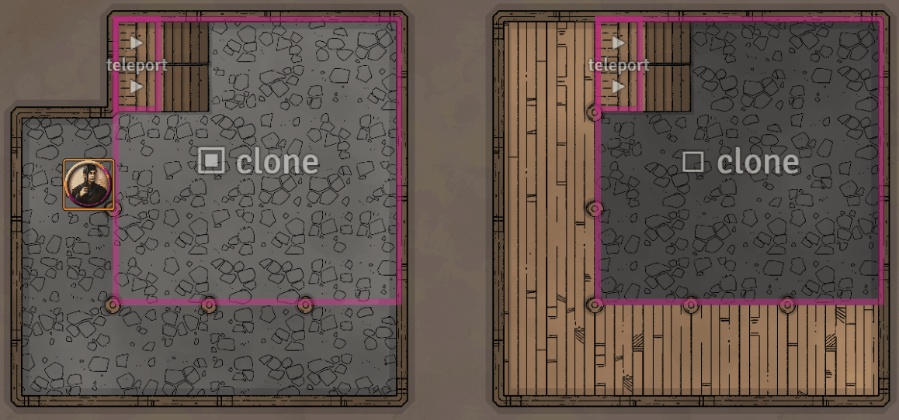
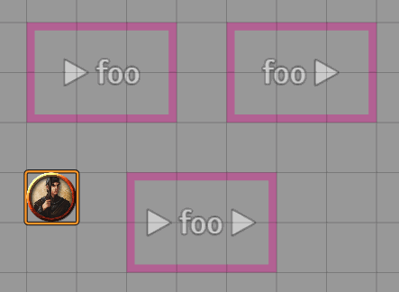
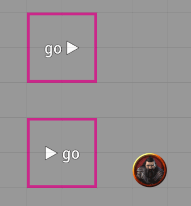
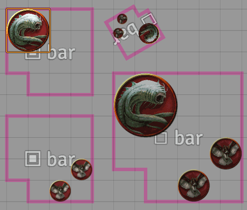

# Multilevel Tokens module for Foundry VTT
 

**Forked from https://github.com/grandseiken/foundryvtt-multilevel-tokens with the author authorization on june 2024.**

**Beneos is now the official maintener of multilevel-tokens module.**

This module for FoundryVTT adds several helpful token automation features, particularly (but not only) suited to maps with multiple levels.
* Teleport tokens to another location when they move into a particular region (e.g. from the bottom of a staircase to the top).
* Clone tokens from one region to another, syncing movement and other property updates (e.g. allowing players to "see" what is happening on floors below).
* Trigger macros when a token enters or leaves a particular region.



All of the features work using Foundry's built in drawing tools. A new tab in the **Drawing Configuration** window for any rectangle, ellipse or polygon drawing allows the designated region to be configured with special behaviour:


You might also like my other module, [Vehicles and Mechanisms](https://github.com/grandseiken/foundryvtt-vehicles-and-mechanisms).

## Installation

You can install this module by searching for it in Foundry's built-in module browser, or with the following public URL:

```
https://raw.githubusercontent.com/grandseiken/foundryvtt-multilevel-tokens/master/module.json
```

Remember to enable the module in the **Manage Modules** menu after installation.

## General use

* Any rectangle, ellipse or polygon drawing can be used to define a special region for automation. The shape and rotation of the drawings will be taken into account. You can use the polygon tool to create complex shapes.
* Double-click on a drawing to open the **Drawing Configuration** window. The module features are found in the new **Multilevel** tab of this window.
* Drawings configured in this way are automatically hidden from your players and given a descriptive label for visual identification; these settings can be manually overridden.
* A GM user must be logged in to your Foundry instance for the module to function. The module works by watching for updates on the GM's client and issuing commands with GM permissions in the background, so it can't function without the GM present.

## Creating teleport regions

To create a teleport, you need at least two regions with the same **Teleport identifier**. The **In** box should be checked for teleport starting locations, and the **Out** box for teleport destinations. Any token that moves into an **In** region will be teleported to an **Out** region with a matching identifier. If there is more than one such destination region, one will be chosen randomly.

You can check both the **In** and **Out** boxes (on two regions with the same identifier) to create a two-way teleport.



### Notes

* Teleport regions can be any size or shape you like. Tokens will be teleported to the correct relative position within the **Out** region based on where they entered the **In** region.
* An **Out** region can be on the same scene as an **In** region, or on a different scene. If a player-owned token teleports to a different scene, the player will be pulled to the new scene along with it; GM users will not be pulled.
* You can check the **Scene-local** box to prevent a teleport region from matching with regions on any other scene. This can be useful if you only need to teleport within a single scene, and don't want to worry about accidentally choosing an identifier that was used elsewhere.
* If you check the **Snap to grid** box on an **Out** region, tokens that teleport to the region will be snapped to the grid. This can be useful if your teleport regions are not exactly lined up with the grid, or are placed in narrow corridors where an off-grid token could get stuck.
* If you check the **Animate movement** box, a teleporting token will move to the destination as if by mouse-dragging, rather than instantly disappearing and appearing there.

## Click-to-activate teleports

By default, teleport regions will automatically teleport any token that moves into the **In** region. If you check the **Activate via map note** box on an **In** region, you can instead use a Map Note as a clickable button to activate the teleport.

To set up a Map Note to use as a teleport activation button, you will need to:
* Create a Journal Entry with any name. If you want your players to be able to activate the teleport themselves, you will need to configure the permissions of the Journal Entry so that players have at least the **Observer** permission.
* Drag the Journal Entry onto the map to create a Map Note and position it within the **In** region you wish to activate when it is clicked. You can configure the note with whatever text or icon you like.

If the GM clicks on the map note, all tokens currently within the region will be teleported. If a player clicks on the map note, any tokens they own within the region will be teleported.

If a player has not enabled display of Map Notes, they will be made temporarily visible when a token the player controls is inside an eligible region, so that the button can be clicked.



## Creating token cloning regions

To set up token cloning, you'll need at least two regions with the same **Clone identifier**. The **Source** box should be checked for the region where tokens will be cloned _from_, and the **Target** box for the region where tokens will be cloned _to_. Any tokens in the **Source** region will be automatically cloned to **Target** regions with a matching identifier.

For example, for the typical case of making tokens on the floor below visible from a balcony above, you could create a **Source** region covering the part of the lower level that's visible from above, and a **Target** region in the corresponding "empty space" area of the upper level.

You can check both the **Source** and **Target** boxes (on two regions with the same identifier) to clone tokens in both directions.

Cloned tokens behave a little differently from regular tokens. They can't be moved or deleted independently; they don't have a linked actor, aren't controlled by a player, and don't have vision. By default, they have an extra tint color applied to make them easily distinguishable. They inherit most other properties (visibility, size, name, disposition, and so on) from the original token. Any update made to the original token will be synced to its clones.



### Notes

* Cloning regions can be any size or shape you like, and can be freely moved or rotated. You can use the polygon tool to create complex shapes. The relative sizes and rotations of **Source** and **Target** regions will be taken into account when cloning tokens: clones will be positioned, rotated, and scaled up or down as necessary. It's usually easiest to start with two copies of the same drawing and go from there.
* A **Target** region can be on the same scene as a **Source** region, or on a different scene.
* You can check the **Scene-local** box to prevent a token cloning region from matching with regions on any other scene. This can be useful if you only need tokens to be cloned within a single scene, and don't want to worry about accidentally choosing an identifier that was used elsewhere.
* You can have more than one **Target** region with the same identifier: tokens in matching **Source** region(s) will be cloned to all of them.
* You can have more than one **Source** region with the same identifier: tokens in all of them will be cloned to matching **Target** region(s).
* By default, chat bubbles and player targeting will also be synced between a token and its clones. You can disable either of these options in the **Module Settings** if they cause issues.
* several additional properties are available in the configuration tab for **Target** regions in particular: you can change the tint colour applied to tokens cloned into the region, apply a scaling factor to their sizes, or choose to mirror the positions of the cloned tokens horizontally or vertically within the region.

## Creating level-based teleports

**Level** regions provide an alternative way to set up teleports. This method is a little bit less flexible and does not support cross-scene teleporting, but can more convenient to set up in some cases. It works well for large maps with many small paired teleportation points (e.g. staircases or ladders) between adjacent levels of a building.

To use this method, create a region with the **Level** box checked and an appropriate **Level number** for each level of your map. Mark each stairway entrance exit on each level with a hidden token named _exactly_ **@stairs** (you can set up an actor to drag-and-drop for this purpose).

When a token moves onto a **@stairs** token, it will be teleported to the location of any corresponding **@stairs** token in the same relative position within a **Level** region (on the same scene) one level above or below, if one exists. Note that careful placement is necessary here, so it's recommended to make the **Level** regions exactly the same size and enable snap-to-grid.


## Creating macro trigger regions

You can run a specific macro whenever a token enters, leaves, or moves within a particular area, using **Macro** regions.

Three checkboxes determine which type of events will cause the macro to be triggered:

* If **Trigger on enter** is checked, the macro will be triggered whenever a token moves into the region from outside.
* If **Trigger on leave** is checked, the macro will be triggered whenever a token moves out of the region from inside.
* If **Trigger on move** is checked, the macro will be triggered whenever a token moves from one point inside the region to another point that is also inside it.

The **Macro name** field should be set to the name of the macro to be executed. The macro must have been created by a GM user.

Chat macros will be spoken as if by whichever token entered the region.

Script macros will be executed by the GM whenever one of the chosen events occurs. Within the macro script, the following variables are available:
* `scene`: the `Scene` object containing the token and region in question.
* `region`: a `Drawing` object describing the region that caused the macro to trigger.
* `token`: a `Token` object describing the token that caused the macro to trigger.
* `actor`: the `Actor` object associated with the token.
* `event`: indicates which of type of event occurred. It will have one of the values `MLT.ENTER`, `MLT.LEAVE`, or `MLT.MOVE`. If a macro region is configured to trigger on more than one type of event (e.g. both **Trigger on enter** and **Trigger on leave** are checked), you can use this to run different code in your macro depending on what happened, e.g.:
  ```
  if (event === MLT.ENTER) {
    // code run when token enters region
  } else if (event === MLT.LEAVE) {
    // code run when token leaves region
  }
  ```
* `args`: an array containing the values supplied in the **Additional arguments** field of the **Macro** region. This field takes a comma-separated list of values. Each value is interpreted as either a `String`, `Number` or `Boolean` as appropriate; double-quotes can be used to force a value to be interpreted as a `String` or to supply a `String` containing commas. For example, entering `1, false, foo, bar` into the **Additional arguments** field would result in the `args` array `[1, false, "foo", "bar"]`, but entering `"1", "false", "foo, bar"` would result in the `args` array `["1", "false", "foo, bar"]`.

Note that script macros triggered in this way run on the GM's client, and the GM might not currently be viewing the scene in question. In this case, the `Drawing` and `Token` objects mentioned above will be temporary objects created purely for the macro's execution, rather than the currently-visible ones found in `canvas.tokens` and `canvas.drawings`.

## Enabling and disabling regions

Any automation region can be temporarily disabled by checking the **Disable region** box in the configuration tab. This can be useful if you want to set automation up in advance, but only enable it when needed.

You can also enable or disable an automation region from e.g. a macro. The flag is stored in `data.flags["multilevel-tokens"].disabled`. With a `Drawing` object stored in the variable `drawing`, the following snippet would toggle the region between enabled and disabled:

```
drawing.update({flags: {"multilevel-tokens": {disabled: !drawing.data.flags["multilevel-tokens"].disabled}}});
```

## Troubleshooting

* Drawings need to have been _created_ by a user with the `GAMEMASTER` role in order to function as automation regions and provide the **Multilevel** configuration tab.
* As mentioned earlier, the module needs a Gamemaster logged in to function properly, since it works by tracking changes on the GM's client and issuing commands with GM permissions in the background to manipulate tokens. If cloned tokens become out of sync because of this, you can use the snippet `game.multilevel.refreshAll()` (e.g. from a script macro) to wipe and recreate all cloned tokens. The GM can also log out and back in, which have the same effect.
* The above point means performance impact should be low, because most of the complicated logic runs only on the GM's client. Player clients only have to deal with the updates that occur as a result.
* The module will detect if more than one GM user is logged in, and only run on one of their clients. However, it can't currently detect if a _single_ GM user is logged in via multiple browser sessions, and problems may arise in that case due to the logic executing multiple times.
* If "link actors of cloned tokens" module setting is disabled, cloned tokens are not associated with any actor, and this can sometimes cause compatibility issues with other macros or modules. Foundry allows a token to have no actor, but, as this is a somewhat unusual case, it's often not accounted for. Most commonly, this can result in the macro or module throwing an error like `TypeError: Cannot read property 'data' of null`.
* Many Foundry modules (including Multilevel Tokens itself) use _module-specific flags_ as a way to store additonal persistent custom data on tokens for their own purposes. It's not possible to predict whether or not it makes sense for _cloned_ tokens to inherit the custom flags set by another module, as the meaning of those flags depends on the module in question. By default, flags set by other modules will be copied to cloned tokens, but you can try disabling this in the **Module Settings** if you experience compatbility issues.
* If something still isn't working you can file an issue here or reach me at `grand#5298` on the discord.

# Version history

* **1.7.0**:
  * Compatibility with Foundry version 12.
* **1.6.0**:
  * Compatibility with Foundry version 10.
  * Slightly reorganised the UI.
  * Support for freehand drawings.
  * Clone target regions can now specify an opacity value to be applied to cloned tokens.
  * When a token moves into a teleport region, the teleport now triggers only once the movement animation (if any) has completed, avoiding visual glitches.
  * Added a new module setting "Link actors of cloned tokens" (on by default). When enabled, cloned tokens share actor data with the original token. Clones of tokens with the "Link actor data" option disabled (i.e. NPC tokens where each token has its own data) share the original token's copy of the actor data. This should avoid incompatibilities with other modules that don't handle the case where a token does not have a valid actor. In case it causes some other problem, the previous behaviour can be restored by disabling the setting.
* **1.5.4**:
  * Fix in handling of drawings in scene import.
  * Only show temporary active effects on cloned tokens.
* **1.5.3**:
  * Fixed interaction between cloned tokens and the new Active Effects system and combat updates in Foundry version 9.
* **1.5.2**:
  * Removed workaround for issues with CTRL+drag measured movement that is now unnecessary on Foundry 0.8.7.
  * Fixed use of deprecated `Document#hasPerm` method.
* **1.5.1**:
  * Fixed that regions defined using the polygon drawing tool didn't function properly after the 0.8.x update.
  * Worked around visual glitches that occurred when a token was moved into a teleport region using the CTRL+drag measured movement action.
* **1.5.0**:
  * Updated for compatibility with Foundry 0.8.x series. No longer compatible with 0.7.x series.
  * Added German localization (contributed by [CarnVanBeck](https://github.com/CarnVanBeck)).
* **1.4.2**:
  * Fixed ordering of macro region triggers. Triggers for tokens leaving should now correctly run before triggers for entering.
  * Cloned tokens are no longer needlessly deleted and recreated when ensuring consistency on startup (contributed by [DemianWright](https://github.com/DemianWright)).
  * Updated Spanish localization (contributed by [lozalojo](https://github.com/lozalojo)).
* **1.4.1**:
  * Fixed that map notes couldn't be moved after being placed in a click-to-activate region.
* **1.4.0**:
  * Fixed incorrect calculations for hex grids that was (in particular) causing issues for Vehicles and Mechanisms.
  * Fixed snap-to-grid option when teleporting between scenes with square grids of differing size.
  * Fixed calculations for regions with negative width or height.
  * Slightly increased tolerance for placing click-to-activate map notes.
  * Fixed that standard map note UI functionality (e.g. deleting) was disabled by the click-to-activate via map note feature.
  * When updating a cloned token to mirror changes to the original, fields that did not actually change are no longer needlessly updated.
  * Fixed that a macro region whose macro updated the triggering token could cause spurious additional events to fire on the macro region.
  * Added Japanese localization (contributed by `touge`).
  * Updated Spanish localization.
* **1.3.4**:
  * Fixed issue introduced by workarounds added in v1.3.3 that prevented cloned tokens from animating when moved.
* **1.3.3**:
  * Added workarounds for some issues introduced by the Foundry 0.7.x release series. Remains compatible with 0.6.x.
* **1.3.2**:
  * Updated Korean localization for features added in 1.3.0 (contributed by KLO).
  * When a token moves from one macro region into another in a single movement, exit triggers for the first region are now run _before_ enter triggers for the second. This avoids issues with cleanup code for the first region interfering with on-enter code for the second in common use-cases.
* **1.3.1**:
  * Fixed cross-scene teleports, which were broken on 1.3.0.
* **1.3.0**:
  * Added Spanish translation (contributed by [Evolatum](https://github.com/Evolatum)).
  * Added a new **Activate via map note** setting for teleport In regions, disabled by default. When enabled, the teleport must be triggered manually by clicking on a Map Note in the region. Map Notes will be temporarily visible for players who own a token inside such a region even if they have not enabled display of Map Notes.
  * Added a new **Snap to grid** setting for teleport Out regions, enabled by default. When enabled, tokens that teleport to the Out region will be snapped to the grid.
  * Macros triggered by macros regions can now access the `Actor` object associated with the token triggering the macro, available in the `actor` variable.
  * Clone target regions can now be configured to apply a scaling factor to the sizes of cloned tokens.
  * The width and height of cloned tokens are now scaled independently if the source and target regions have different aspect ratios.
  * Cloned tokens are now positioned and scaled correctly even across scenes with different grid sizes or grid types. Previously, this could result in minor inaccuracies.
* **1.2.0**:
  * Added French translation (contributed by [`Meï#4242`](https://github.com/MeixDev)).
* **1.1.0**:
  * Module now allows for localization; contributions extremely welcome!
  * Added Korean translation (contributed by KLO).
  * Where possible, moving a source or target region will now cause cloned tokens to move to their new correct positions, rather than being deleted and recreated.
* **1.0.0**:
  * Overhauled the user interface to make the module easier to use. Regions are now configured using a dedicated interface within a tab in the Drawing Configuration window for any applicable drawing. It's no longer necessary to add text labels containing special syntax to each drawing.
  * Short descriptive labels are still added (automatically) to each region for clarity, but have no special meaning. They can be overridden by editing the label text manually.
  * Regions are now automatically set to be hidden from players by default.
  * Regions set up using the old mechanism will be automatically updated to the new format.
  * A single drawing may now serve multiple purposes at once. For example, a region can be both a teleport and a macro trigger, or both a clone source and a clone target.
  * Removed the global module setting for tinting cloned tokens. This can now be configured individually for each clone target region.
  * Removed the global module setting for animating token movement when teleporting. This can now be enabled or disabled individually for each teleport region.
  * Clone target regions can now be configured to mirror token positions horizontally or vertically.
  * Macro regions now support passing a fixed set of additional arguments to the macro when triggered, available in the new `args` variable.
  * Macro regions now support also triggering the macro when a token leaves the region, or whenever a token moves within it. Each of the triggers can be enabled or disabled for a region individually. A new `event` variable available to the macro describes which type of event occurred.
  * Fixed that the `Drawing` and `Token` objects provided to macros triggered by macro regions would not be correctly associated with a `Scene`, causing e.g. their `update()` methods to misfunction, if the GM was viewing a different scene when the region was triggered.
  * Regions can now be temporarily disabled with a new checkbox in the configuration menu.
* **0.4.1**:
  * Fixed a floating-point accuracy issue that sometimes led to level-based teleports with `@stairs` tokens not functioning.
* **0.4.0**:
  * Added another way to set up teleports using `@level` regions (contributed by [TheGiddyLimit](https://github.com/TheGiddyLimit)).
  * Added a way to trigger macros using `@macro` regions.
  * Added a module setting to copy flags set by other modules when cloning tokens, to aid compatibility, default on.
  * Fixed an issue that could result in tokens being duplicated when teleporting between scenes.
  * Fixed that marked regions would not function when imported as part of scene data using Foundry's scene import / export feature.
* **0.3.0**:
  * Added a module setting to animate token movement when teleporting to the scene same, default off.
  * Added a module setting to also show chat bubbles on each copy of a token, default on.
  * Added a module setting to synchronize player targeting between original and cloned tokens, default on.
  * Toggling the combat state of a cloned token will now toggle the combat state of its original instead, if on the same scene.
  * Editing a cloned token via the token HUD or configuration menu will now apply the changes to the original token, rather than silently discarding the update.
  * Region identifiers that start with `!` are now scene-local and won't match with regions on other scenes.
  * Fixed compatibility issue with missing actor ID on cloned tokens, affecting at least the Token Mold module.
  * Fixed that tokens deleted by the module weren't removed from combat.
* **0.2.0**:
  * Added support for ellipse and polygon regions.
  * Rotation of drawings is now taken into account.
  * Cloned regions now update when a scene is created or deleted.
  * Fixed incorrect behaviour that could occur when a scene was duplicated.
  * Fixed that a cloned token could be copy-pasted, resulting in a temporary stuck token.
  * Fixed an error that could occur when a rectangle had no `text` property.
* **0.1.0**:
  * First version.
